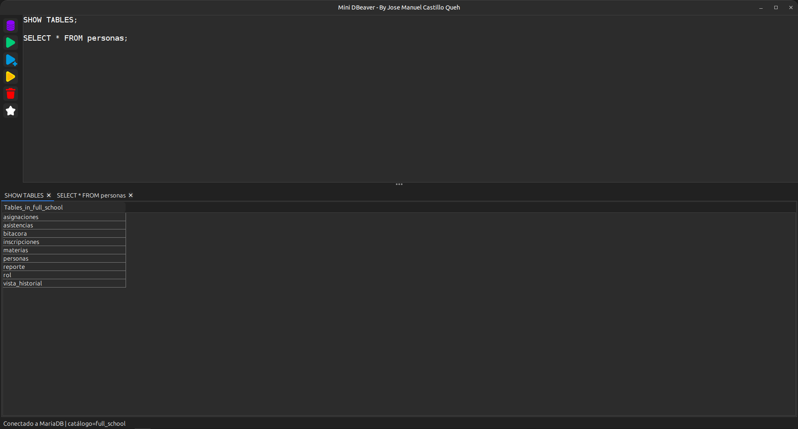
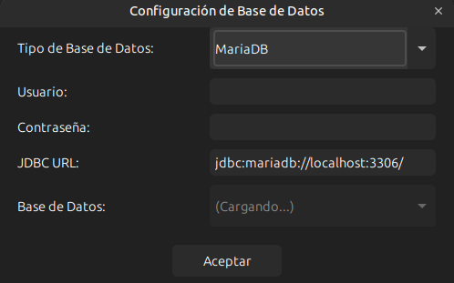
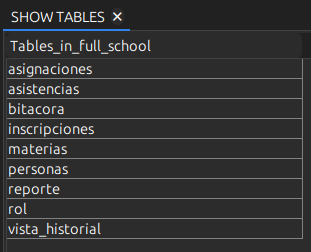

# 🐿️ Mini DBeaver


**Mini DBeaver** es un cliente de base de datos ligero y moderno desarrollado en Java Swing, inspirado en DBeaver. Permite conectarse a bases de datos MySQL y MariaDB para ejecutar consultas SQL de forma intuitiva y visual.

---

## ✨ Características

- 🔌 **Conexión a MySQL y MariaDB**: Soporte completo para ambos motores de base de datos
- 📝 **Editor SQL Inteligente**: Editor con resaltado de sintaxis y ejecución flexible
- ⚡ **Múltiples Modos de Ejecución**:
  - Ejecutar línea actual (Ctrl+Enter)
  - Ejecutar selección
  - Ejecutar todo el script
- 🗂️ **Selector Automático de Bases de Datos**: Carga automática de todas las bases de datos disponibles
- 📊 **Visualización de Resultados**: Tablas interactivas con pestañas cerrables
- 💾 **Persistencia de Estado**: Guarda automáticamente el contenido del editor y el catálogo activo
- 🎨 **Interfaz Moderna**: Diseño limpio con iconos intuitivos
- 🔄 **Soporte para Múltiples Sentencias**: Ejecuta varios comandos SQL separados por punto y coma

---

## 🚀 Instalación

### Prerrequisitos

- **Java 8** o superior
- **Maven** (opcional, para compilación)
- Drivers JDBC:
  - `mariadb-java-client` para MariaDB
  - `mysql-connector-java` para MySQL

### Clonar el Repositorio

```bash
git clone https://github.com/CastilloDevX/MiniDBeaver.git
cd MiniDBeaver
```

### Compilación

```bash
javac -d bin src/org/minidbeaver/MiniDBeaver.java
```

O usando Maven:

```bash
mvn clean package
```

### Ejecución

```bash
java -cp bin org.minidbeaver.gui.MiniDBeaver
```

---

## 📖 Uso

### 1. Conectar a una Base de Datos

1. Haz clic en el botón **🛢️ Database Settings** (icono de base de datos)
2. Completa los campos:
   - **Tipo de Base de Datos**: Selecciona MariaDB o MySQL
   - **Usuario**: Tu usuario de base de datos
   - **Contraseña**: Tu contraseña
   - **JDBC URL**: Se completa automáticamente (formato: `jdbc:mariadb://localhost:3306/`)
   - **Base de Datos**: Se carga automáticamente al completar los campos anteriores
3. Haz clic en **Aceptar**

### 2. Escribir y Ejecutar SQL

El editor SQL soporta varios comandos:

```sql
-- Cambiar de base de datos
USE mi_base_de_datos;

-- Consultas SELECT
SELECT * FROM usuarios WHERE edad > 18;

-- Operaciones DML
INSERT INTO productos (nombre, precio) VALUES ('Laptop', 999.99);
UPDATE productos SET precio = 899.99 WHERE nombre = 'Laptop';
DELETE FROM productos WHERE id = 5;

-- Operaciones DDL
CREATE TABLE clientes (
    id INT PRIMARY KEY AUTO_INCREMENT,
    nombre VARCHAR(100),
    email VARCHAR(100)
);
```

### 3. Atajos de Teclado

| Atajo | Acción |
|-------|--------|
| `Ctrl + Enter` | Ejecutar línea actual o selección |

### 4. Botones de Acción

- 🔧 **Database Settings**: Configurar conexión
- ▶️ **Execute Line**: Ejecutar línea actual
- 📄 **Execute Selection**: Ejecutar texto seleccionado
- 🔄 **Execute All**: Ejecutar todo el script
- 🧹 **Clear**: Limpiar todas las pestañas de resultados

---

## 🏗️ Arquitectura

```
org.minidbeaver/
└── MiniDBeaver.java          # Clase principal con la interfaz gráfica
```

### Componentes Principales

- **Editor SQL**: `JTextArea` con fuente monoespaciada para escribir consultas
- **Panel de Botones**: Acciones rápidas para ejecutar SQL
- **Pestañas de Resultados**: Visualización de resultados en tablas o mensajes
- **Barra de Estado**: Muestra el estado de la conexión y catálogo activo

---

## 🛠️ Tecnologías Utilizadas

- **Java Swing**: Framework para la interfaz gráfica
- **JDBC**: Conectividad con bases de datos
- **Java Preferences API**: Persistencia de configuración
- **MariaDB Connector/J**: Driver JDBC para MariaDB
- **MySQL Connector/J**: Driver JDBC para MySQL

---

## 📋 Características Técnicas

- **Parsing Inteligente de SQL**: Divide correctamente sentencias respetando comillas y delimitadores
- **Manejo de Catálogos**: Soporte para comando `USE` y persistencia del catálogo activo
- **Gestión de Conexiones**: Control automático del ciclo de vida de conexiones JDBC
- **UI Responsiva**: Carga de bases de datos en hilos separados para no bloquear la interfaz
- **Límite de Resultados**: Máximo de 10,000 filas por consulta para optimizar rendimiento

---

## 🎯 Roadmap

- [ ] Soporte para PostgreSQL y SQLite
- [ ] Autocompletado de SQL
- [ ] Resaltado de sintaxis avanzado
- [ ] Exportación de resultados a CSV/Excel
- [ ] Historial de consultas
- [ ] Temas de colores (modo oscuro)
- [ ] Gestor de conexiones guardadas
- [ ] Explorador de esquemas y tablas

---

## 🤝 Contribuciones

Las contribuciones son bienvenidas. Por favor:

1. Haz fork del proyecto
2. Crea una rama para tu feature (`git checkout -b feature/AmazingFeature`)
3. Commit tus cambios (`git commit -m 'Add some AmazingFeature'`)
4. Push a la rama (`git push origin feature/AmazingFeature`)
5. Abre un Pull Request

---

## 📝 Licencia

Este proyecto está bajo la Licencia MIT. Ver el archivo `LICENSE` para más detalles.

---

## 👤 Autor

**Jose Manuel Castillo Queh**

- GitHub:[CastilloDevX](https://github.com/CastilloDevX)

---

## 🙏 Agradecimientos

- Inspirado en [DBeaver](https://dbeaver.io/)
- Iconos de [Material Design Icons](https://materialdesignicons.com/)

---

## 📸 Screenshots

### Ventana Principal


### Configuración de Conexión


### Resultados de Consulta


---

## 🐛 Reportar Problemas

Si encuentras algún bug o tienes sugerencias, por favor abre un [issue](https://github.com/CastilloDevX/MiniDBeaver/issues).

---

<div align="center">
 
**Hecho con ❤️ usando Java Swing**

</div>